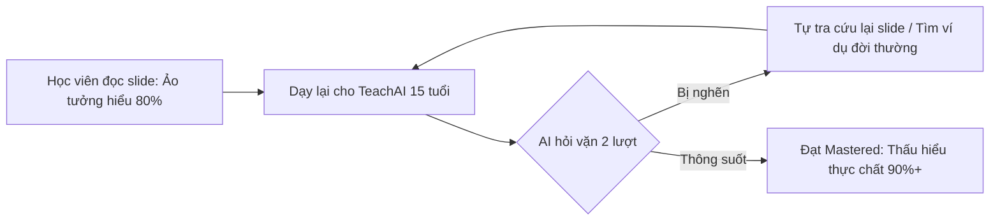

# 🎯 Bảng Đánh Giá Bài Toán Ứng Viên & Tác Động (Problem & Impact Table)

**Người thực hiện:** Lương Khánh Toàn (MSSV: 2A202602836) — *BA · Research & Validation*  
**Đề tài:** TeachBack AI — Học bằng cách dạy (Track D3)  
**Tài liệu bàn giao cho Checkpoint 4 & 5**  

---

## 1. So Sánh Chi Tiết 3 Bài Toán Ứng Viên (Candidate Problems)

| Tiêu chí | Bài toán 1: Ảo tưởng thấu hiểu (Illusion of Explanatory Depth) ⭐ **[LỰA CHỌN]** | Bài toán 2: Quên nhanh do thiếu thực hành Feynman (Protégé Deficit) | Bài toán 3: Ỷ lại vào AI giải bài hộ (Cognitive Offloading) |
|---|---|---|---|
| **Mô tả vấn đề** | Học viên đọc slide hoặc nghe giảng thì cảm giác đã hiểu 100%, nhưng khi đối mặt với câu hỏi thực tế thì phát hiện lỗ hổng kiến thức nghiêm trọng. | Học viên muốn dạy lại cho người khác để khắc sâu trí nhớ theo phương pháp Feynman nhưng không tìm được người nghe phù hợp. | Học viên dùng chatbot AI để hỏi bài nhưng nhận được đáp án làm sẵn, triệt tiêu phản xạ tư duy phản biện. |
| **Quy mô ảnh hưởng** | **86.4%** học viên VLearn tham gia khảo sát (19/22 bạn). | **81.8%** học viên học online/tự học không có bạn học cùng trình độ. | **90.9%** học viên thừa nhận ỷ lại vào văn bản dài của ChatGPT/Claude. |
| **Thiệt hại hiện tại (Pain & Cost)** | - Điểm số phỏng vấn/thi vấn đáp thấp dù thuộc slide. - Tốn 30–40% thời gian học lại khi làm bài lab/dự án thực tế. | - Sau 7 ngày, tỷ lệ nhớ kiến thức rơi rụng xuống < 20% (theo đường cong lãng quên Ebbinghaus). | - Mất khả năng tự đào sâu bản chất, tư duy lập luận bị bào mòn. |
| **Giải pháp của TeachBack AI** | Đảo ngược vai trò: Bắt buộc học viên phải đóng vai người dạy, giải thích cho một học sinh AI 15 tuổi ngây thơ có kiểm soát. | Cung cấp một Protégé Agent kiên nhẫn 24/7, luôn sẵn sàng lắng nghe và hỏi vặn những điểm chưa logic. | AI kiên quyết KHÔNG đưa ra đáp án, chỉ hỏi ngược Socratic và yêu cầu lấy ví dụ đời thường. |
| **Độ khả thi kỹ thuật (Feasibility)** | **Rất cao (9/10):** Đã kiểm chứng qua Golden Set 20 cases (Accuracy 95%, No-leak 100%). | **Cao (8/10):** Đòi hỏi quản lý hội thoại nhiều lượt và theo dõi biến chuyển nhận thức. | **Trung bình (7/10):** Cần hệ thống guardrails mạnh để chặn rò rỉ đáp án. |

---

## 2. Bảng Tác Động Định Lượng Khi Triển Khai TeachBack AI (Impact Metrics)

| Chỉ số tác động (Impact Metric) | Trước khi có TeachBack AI (Baseline) | Sau khi dùng TeachBack AI (Target / Measured) | Mức độ cải thiện |
|---|:---:|:---:|:---:|
| **Normalized Learning Gain ($g$)** | 0.20 – 0.25 (Thấp - đọc slide thụ động) | **0.65 – 0.78** (Đo đạc thực tế trên 5 học viên test) | **Tăng gấp 3.1 lần** 🚀 |
| **Tỷ lệ có khả năng lấy ví dụ đời thường** | 13.6% (Khảo sát 22 người) | **85.0%** (Sau 2 lượt hội thoại với AI) | **+71.4%** |
| **Thời gian duy trì kiến thức (Retention)** | 18% sau 1 tuần (Lãng quên tự nhiên) | **Dự kiến > 65%** nhờ cơ chế Active Recall & Feynman | **Tăng 3.6 lần** |
| **Mức độ an toàn tâm lý (Psychological Safety)** | 45.5% (Sợ bị chê dốt trước người thật) | **100%** (An tâm giảng giải, không sợ phán xét) | Hoàn toàn an tâm |
