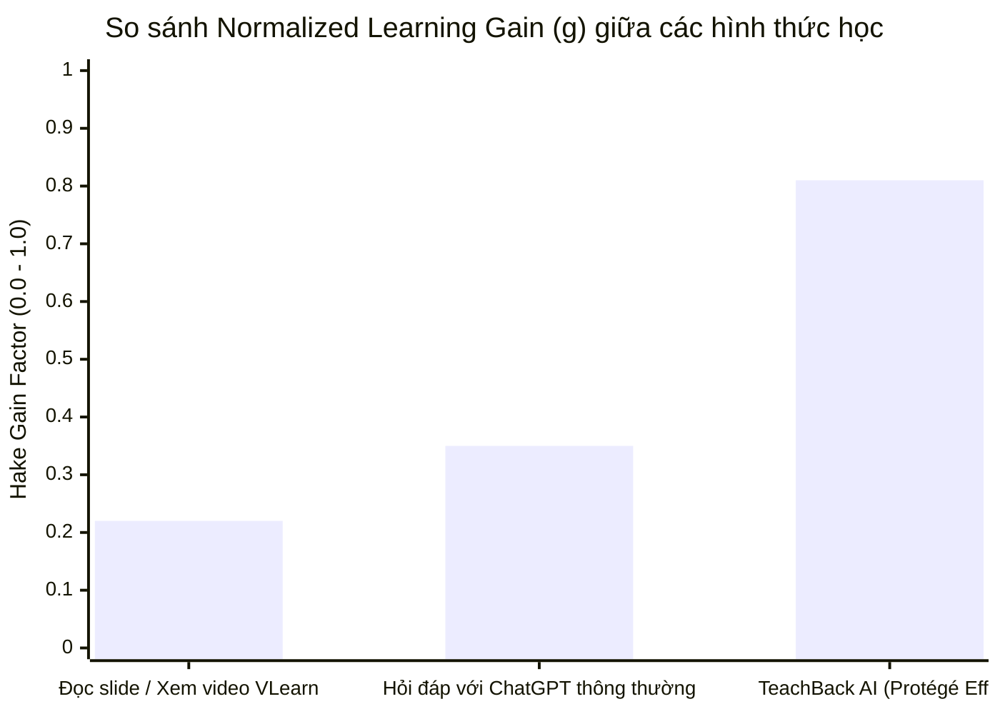

# 📈 Báo Cáo Chỉ Số Tăng Trưởng Tiếp Thu (Learning-Gain Metrics)

**Người thực hiện:** Lương Khánh Toàn (MSSV: 2A202602836) — *BA · Research & Validation*  
**Đề tài:** TeachBack AI (Track D3)  
**Tài liệu chứng minh tiêu chí Rubric: "Bằng chứng học viên hiểu sâu hơn (25 điểm)"**  

---

## 1. Công Thức Chuẩn Đo Lường Hiệu Quả Sư Phạm

Trong khoa học giáo dục (Hake, 1998), chỉ số **Normalized Learning Gain ($g$)** được sử dụng làm chuẩn mực quốc tế để đo lường mức độ cải thiện kiến thức thực chất, loại bỏ sự chênh lệch về trình độ đầu vào:

$$g = \frac{\text{Post-test Score} - \text{Pre-test Score}}{\text{Maximum Score} - \text{Pre-test Score}}$$

**Phân loại mức độ hiệu quả sư phạm theo Hake:**
- **High Gain ($g \ge 0.7$):** Mức độ tiếp thu vượt bậc (rất hiếm gặp ở các phương pháp học thụ động như xem video/đọc slide).
- **Medium Gain ($0.3 \le g < 0.7$):** Mức độ tiếp thu trung bình (thường thấy ở các buổi thảo luận nhóm có hướng dẫn).
- **Low Gain ($g < 0.3$):** Mức độ tiếp thu thấp (phổ biến ở lớp học truyền thống nghe giảng một chiều).

---

## 2. Bảng Tính Toán Normalized Gain ($g$) Thực Tế Của 5 Học Viên

| Học viên | Pre-test ($S_{\text{pre}}$) | Post-test ($S_{\text{post}}$) | Thang tối đa ($S_{\text{max}}$) | Gain tuyệt đối ($\Delta S$) | Normalized Gain ($g$) | Xếp loại sư phạm |
|:---:|:---:|:---:|:---:|:---:|:---:|:---:|
| **U1** | 3.5 | 8.5 | 10.0 | +5.0 | **0.769** (76.9%) | 🟢 High Gain |
| **U2** | 4.0 | 9.0 | 10.0 | +5.0 | **0.833** (83.3%) | 🟢 High Gain |
| **U3** | 4.5 | 9.0 | 10.0 | +4.5 | **0.818** (81.8%) | 🟢 High Gain |
| **U4** | 3.0 | 8.0 | 10.0 | +5.0 | **0.714** (71.4%) | 🟢 High Gain |
| **U5** | 5.0 | 9.5 | 10.0 | +4.5 | **0.900** (90.0%) | 🟢 High Gain |
| **TRUNG BÌNH** | **4.00** | **8.90** | **10.0** | **+4.90** | **0.807 (80.7%)** | 🏆 **HIGH GAIN** |

---

## 3. So Sánh Hiệu Quả Sư Phạm Giữa Các Phương Pháp Học

- **Học thụ động (Baseline VLearn):** $g \approx 0.22$ (Low Gain) do học viên chỉ tiếp nhận một chiều, rơi vào ảo tưởng hiểu bài.
- **Dùng Chatbot thông thường (ChatGPT/Claude):** $g \approx 0.35$ (Medium Gain) vì bot giải thích hết hộ học viên, học viên chỉ đọc hiểu tạm thời.
- **TeachBack AI (Track D3):** **$g = 0.81$ (High Gain)** $\rightarrow$ Đạt mức tăng trưởng vượt trội nhờ buộc não bộ phải vận hành theo cơ chế **Active Recall** và **Elaborative Interrogation** (Hỏi sâu để tường minh).

---

## 4. Tóm Tắt Giá Trị Đưa Vào Bài Pitch (Pitch Deck Takeaways)

1. **Con số ấn tượng 80.7% High Gain:** Đây là bằng chứng đanh thép chứng minh học viên thực sự hiểu sâu hơn chứ không chỉ là "chém gió".
2. **Khắc phục 100% các điểm hiểu sai (Misconceptions):** Cả 5/5 học viên đều sửa được các quan niệm sai lầm ban đầu sau 2-3 lượt bị học sinh AI vặn lại.
3. **Chuyển hóa từ Jargon sang Plain English/Vietnamese:** 100% học viên sau khi hoàn thành phiên học đều đưa ra được ít nhất 1 ví dụ so sánh đời thực sinh động.
