# 🧪 Kết Quả Thử Nghiệm Pre/Post-Test Với 5 Học Viên Thật (Pre & Post-Test Results)

**Người thực hiện:** Lương Khánh Toàn (MSSV: 2A202602836) — *BA · Research & Validation*  
**Đối tượng kiểm thử:** 5 Willing Users (`U1` đến `U5`)  
**Môi trường thử nghiệm:** Giao diện TeachAI thật tại `http://localhost:5173/playground`  
**Ngày thực hiện:** 17/09/2026  

---

## 1. Phương Pháp Luận Thử Nghiệm (Testing Methodology)

1. **Pre-test (Trước khi dạy AI):**
   - Học viên được yêu cầu trả lời 1 câu hỏi cốt lõi bằng lời văn của mình: *"Hãy giải thích cơ chế và bản chất của khái niệm này bằng ví dụ đời thường cho một học sinh 15 tuổi."*
   - Chấm điểm trên thang 5 tiêu chí (thang điểm 10):
     * Tính chính xác về mặt khoa học (3đ).
     * Khả năng liên hệ ví dụ đời thường (3đ).
     * Mức độ tự tin và gãy gọn (2đ).
     * Tránh thuật ngữ sáo rỗng / jargon (2đ).
2. **Giai đoạn tương tác với TeachAI (Intervention):**
   - Học viên truy cập `http://localhost:5173/playground`, chọn bài học tương ứng.
   - Trải qua 2 – 3 lượt hội thoại với học sinh AI 15 tuổi (bị hỏi vặn, yêu cầu ví dụ, kiểm tra misconception).
3. **Post-test (Sau khi AI đạt trạng thái Mastered):**
   - Học viên được yêu cầu giải thích lại khái niệm đó một lần nữa.
   - Chấm điểm lại theo đúng rubric trên để tính độ tăng trưởng tiếp thu (Learning Gain).

---

## 2. Bảng Kết Quả Chi Tiết 5 Học Viên Thử Nghiệm

| Mã HV | Khái niệm kiểm thử | Điểm Pre-test (/10) | Tình trạng trước khi dùng | Điểm Post-test (/10) | Tình trạng sau khi dạy TeachAI | Số lượt hội thoại (Turns) | Trạng thái AI cuối cùng |
|:---:|---|:---:|---|:---:|---|:---:|:---:|
| **U1** | *Vì sao LLM bịa (Hallucination)* | **3.5** | Hiểu sai: Nghĩ do virus hoặc thiếu RAM, không nêu được ví dụ. | **8.5** | Hiểu đúng cơ chế Next-token prediction, ví von như "trò chơi nối từ chỉ quan tâm vần điệu chứ không quan tâm sự thật". | 3 turns | `mastered` ⭐ |
| **U2** | *Context Window* | **4.0** | Tưởng context càng to càng tốt, không biết đến hiện tượng Lost-in-the-middle hay chi phí tính toán. | **9.0** | So sánh Context Window như cái "mặt bàn làm việc", nhiều tài liệu quá thì bị che khuất và rối mắt. | 2 turns | `mastered` ⭐ |
| **U3** | *RAG & Grounding* | **4.5** | Nghĩ RAG là nạp dữ liệu huấn luyện lại mô hình, dán nguyên văn định nghĩa từ slide. | **9.0** | Phân biệt rõ RAG là "cho mở sách tra cứu khi đi thi" chứ không phải bắt học thuộc lòng. | 3 turns | `mastered` ⭐ |
| **U4** | *Google PAIR Reframe* | **3.0** | Không biết khi nào nên dùng AI, nghĩ bài toán nào AI cũng giải được. | **8.0** | Nắm vững 2 câu hỏi bản lề: Có giải quyết độc bản không? Và có chấp nhận sai số được không? | 2 turns | `mastered` ⭐ |
| **U5** | *Temperature* | **5.0** | Thuộc công thức softmax nhưng không giải thích được trực quan cho người thường hiểu. | **9.5** | Ví von Temperature như "núm vặn độ liều lĩnh / sáng tạo" của người đầu bếp. | 2 turns | `mastered` ⭐ |

---

## 3. Phân Tích Sự Chuyển Biến Nhận Thức

```mermaid
xychart-beta
    title "So sánh Điểm số Pre-test vs Post-test (Thang 10)"
    x-axis ["U1 (Hallucination)", "U2 (Context)", "U3 (RAG)", "U4 (PAIR)", "U5 (Temp)"]
    y-axis "Điểm số" 0 --> 10
    bar [3.5, 4.0, 4.5, 3.0, 5.0]
    bar [8.5, 9.0, 9.0, 8.0, 9.5]
```

- **Điểm Pre-test trung bình:** **4.0 / 10** (Thể hiện rõ hiện tượng ảo tưởng hiểu bài: trước khi test ai cũng nghĩ mình được 7-8 điểm, nhưng khi viết ra chỉ đạt 3-5 điểm).
- **Điểm Post-test trung bình:** **8.8 / 10** (Tăng hơn gấp đôi sau khi vượt qua các câu hỏi hóc búa của học sinh AI).
- **Điểm tăng tuyệt đối trung bình:** **+4.8 điểm**.
